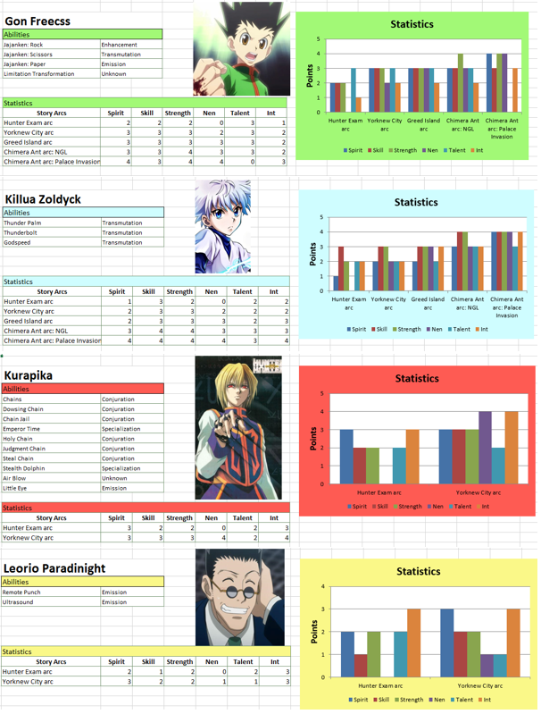

# Excel Templating (2019)

Demo of using pandas `ExcelWriter` to generate styled Excel documentation templates programmatically — coloured headers, formatted cells, structured layout — without touching Excel manually.

The underlying data is Hunter x Hunter character stats crawled from Hunterpedia wiki, used purely as a fun stand-in for the real use case: generating data transformation documentation at work.

> **Note:** Built around 2019. Uses `xlsxwriter` as the writer engine. Not maintained — package versions may have changed since.

## What It Does

1. `hunter.py` — Scrapy spider crawls character stats from Hunterpedia, saves to `hunter.json`
2. `excel.ipynb` — Loads the JSON, feeds it into an `ExcelWriter` template with styled formatting

## Stack

`Python` · `Scrapy` · `Pandas` · `xlsxwriter`
